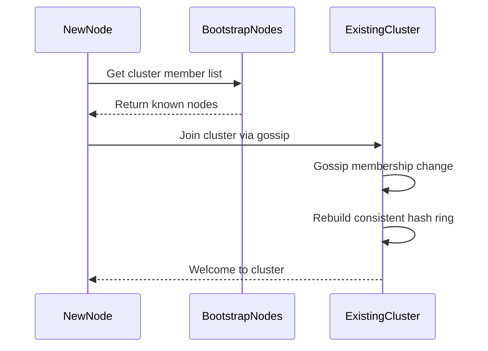
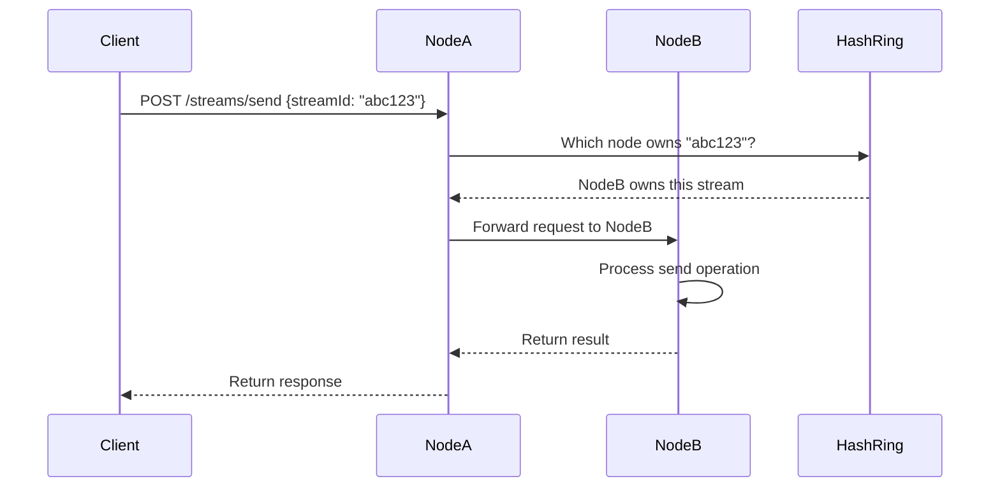
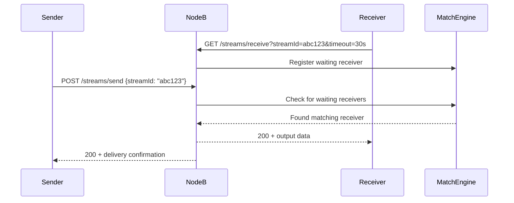

–

## 3. System Flow

### 3.1 Node Startup and Cluster Join


### 3.2 Request Routing and Processing


### 3.3 Sync Matching Within Node


## 4. Detailed Design

### 4.1 Membership Management

#### **HashiCorp Memberlist Integration**
```go
type MembershipManager struct {
    memberlist *memberlist.Memberlist
    nodes      map[string]*Node
    ring       *ConsistentHashRing
    events     chan MembershipEvent
}

type MembershipEvent struct {
    Type EventType // JOIN, LEAVE, FAILURE
    Node *Node
}
```

#### **Cluster Discovery**
- **Bootstrap Configuration**: Environment variable or config file with seed nodes
- **DNS-based Discovery**: Optional SRV record resolution for dynamic discovery
- **Cloud Integration**: Support for AWS/GCP/Azure auto-discovery mechanisms
- **Health Checks**: Periodic health verification and failure detection

### 4.2 Consistent Hashing Implementation

#### **Hash Ring Design**
```go
type ConsistentHashRing struct {
    nodes     map[uint32]*Node
    sortedKeys []uint32
    replicas   int // Virtual nodes per physical node
}

func (r *ConsistentHashRing) GetNode(streamId string) *Node {
    hash := hash(streamId)
    idx := sort.Search(len(r.sortedKeys), func(i int) bool {
        return r.sortedKeys[i] >= hash
    })
    return r.nodes[r.sortedKeys[idx%len(r.sortedKeys)]]
}
```

#### **Virtual Nodes**
- **Replication Factor**: 150-200 virtual nodes per physical node
- **Load Balancing**: Improves distribution uniformity across nodes
- **Minimal Disruption**: Reduces key movement during cluster changes

### 4.3 Request Forwarding

#### **Intelligent Routing**
```go
type RequestRouter struct {
    localNode *Node
    hashRing  *ConsistentHashRing
    client    *http.Client
}

func (r *RequestRouter) Route(streamId string, request *Request) (*Response, error) {
    targetNode := r.hashRing.GetNode(streamId)
    
    if targetNode.ID == r.localNode.ID {
        return r.processLocally(request)
    }
    
    return r.forwardRequest(targetNode, request)
}
```

#### **Forwarding Strategy**
- **HTTP Proxy**: Internal cluster communication via HTTP/1.1 keep-alive
- **Retry Logic**: Handle node failures during request forwarding
- **Circuit Breaker**: Prevent cascade failures from unhealthy nodes
- **Load Balancing**: Round-robin for requests within timeout window

### 4.4 Sync Matching Engine

#### **In-Memory Matching**
```go
type MatchEngine struct {
    waitingSenders   map[string][]*SendRequest
    waitingReceivers map[string][]*ReceiveRequest
    matches          chan *Match
    timeouts         *time.Timer
}

type Match struct {
    SendRequest    *SendRequest
    ReceiveRequest *ReceiveRequest
    Timestamp      time.Time
}
```

#### **Matching Algorithm**
1. **Receive Registration**: Store waiting receivers with timeout context
2. **Send Processing**: Check for matching receivers immediately
3. **Sync Match**: Pair send/receive operations in same time window
4. **Timeout Handling**: Clean up expired waiting operations
5. **FIFO Ordering**: First-in-first-out matching for fairness

### 4.5 Long Polling Implementation

#### **Timeout Management**
```go
type LongPollManager struct {
    activePolls map[string]*PollContext
    cleanup     *time.Ticker
}

type PollContext struct {
    RequestID string
    StreamID  string
    Timeout   time.Duration
    StartTime time.Time
    Cancel    context.CancelFunc
    Response  chan *Response
}
```

#### **Efficient Resource Usage**
- **Context Cancellation**: Proper cleanup of goroutines on timeout
- **Memory Management**: Periodic cleanup of expired poll contexts  
- **Connection Pooling**: Reuse HTTP connections for forwarded requests
- **Graceful Shutdown**: Drain active polls during node shutdown

## 5. Phase Implementation Strategy

### 5.1 Phase 1: Real-time In-Memory Matching

#### **Core Features**
- ✅ Gossip-based cluster formation with memberlist
- ✅ Consistent hashing for stream routing
- ✅ Request forwarding between nodes
- ✅ Sync matching within nodes
- ✅ Long polling with configurable timeouts
- ✅ 424 error handling for timeouts

#### **Technical Scope**
- Single-node operation capability
- Multi-node cluster with up to 10 nodes
- In-memory storage only (no persistence)
- Basic health checking and failure detection

### 5.2 Phase 2: Persistent Storage and Replay

#### **Enhanced Features**
- 📋 `sendAndStore` API implementation
- 📋 Database integration layer (Cassandra, MongoDB, DynamoDB, MySQL, PostgreSQL)
- 📋 Resume token generation and validation
- 📋 TTL-based retention policies
- 📋 Stream position tracking and replay capability

#### **Storage Architecture**
```go
type StreamStorage interface {
    Store(streamId, outputUuid string, output interface{}, ttl time.Duration) error
    Read(streamId string, resumeToken string, limit int) ([]*Output, string, error)
    Delete(streamId string, olderThan time.Time) error
}
```

### 5.3 Phase 3: Stream Partitioning (Future)

#### **Hot Node Mitigation**
- 📋 Stream partitioning for high-traffic streams
- 📋 Dynamic load balancing across multiple nodes
- 📋 Auto-scaling based on stream throughput metrics
- 📋 Advanced routing algorithms for partition distribution

## 6. Fault Tolerance and Edge Cases

### 6.1 Network Partitions

#### **Split Brain Handling**
- **Gossip Convergence**: Allow eventual consistency to resolve partitions
- **Request Timeout**: Return 424 during membership instability
- **Client Retry**: Encourage client-side retry with exponential backoff

### 6.2 Node Failures

#### **Failure Detection**
- **Memberlist Health**: Built-in failure detection via gossip protocol
- **Request Timeout**: Detect failed nodes during request forwarding
- **Ring Rebalancing**: Automatic hash ring reconstruction on node failure

#### **Graceful Degradation**
```go
func (r *RequestRouter) forwardWithRetry(targetNode *Node, request *Request) (*Response, error) {
    resp, err := r.forwardRequest(targetNode, request)
    if err != nil {
        // Node might have failed, recalculate ownership
        newTargetNode := r.hashRing.GetNode(request.StreamID)
        if newTargetNode.ID != targetNode.ID {
            return r.forwardRequest(newTargetNode, request)
        }
        return nil, errors.New("node unavailable")
    }
    return resp, nil
}
```

### 6.3 Membership Changes During Processing

#### **Eventually Consistent Routing**
- **Best Effort**: Forward to node currently believed to own stream
- **Retry on Failure**: Recalculate ownership if forwarding fails
- **Client Transparency**: Return 424 and let client retry if routing is unstable
- **Future Enhancement**: Implement request migration during membership changes

## 7. Performance Characteristics

### 7.1 Scalability Metrics

#### **Target Performance**
- **Cluster Size**: 10-50 nodes in Phase 1
- **Concurrent Streams**: 10,000+ per node  
- **Request Throughput**: 1,000+ operations/second per node
- **Matching Latency**: Sub-10ms for local matches
- **Forwarding Overhead**: +5-15ms for cross-node requests

### 7.2 Resource Utilization

#### **Memory Usage**
- **Waiting Operations**: ~1KB per waiting send/receive
- **Membership Data**: ~100 bytes per node in cluster
- **Hash Ring**: ~50KB for 10-node cluster with 200 virtual nodes
- **Connection Pool**: Configurable based on cluster size

#### **Network Traffic**
- **Gossip Overhead**: <1KB/second per node for membership
- **Request Forwarding**: Proportional to cross-node traffic
- **Health Checks**: Minimal impact with memberlist built-ins

## 8. Operational Considerations

### 8.1 Monitoring and Observability

#### **Key Metrics**
- **Cluster Health**: Node count, membership stability, partition detection
- **Request Metrics**: Local vs forwarded requests, success/failure rates
- **Matching Performance**: Sync match rate, average wait time, timeout rate
- **Resource Usage**: Memory consumption, goroutine count, connection pool stats

### 8.2 Configuration Management

#### **Cluster Configuration**
```yaml
cluster:
  name: "async-output-cluster"
  gossip_port: 7946
  http_port: 8080
  bootstrap_nodes:
    - "node1.example.com:7946"
    - "node2.example.com:7946"
  
matching:
  default_timeout: "30s"
  max_timeout: "300s"
  cleanup_interval: "60s"
  
hash_ring:
  virtual_nodes: 200
```

### 8.3 Deployment Strategy

#### **Rolling Updates**
- **Graceful Shutdown**: Drain active requests before stopping
- **Health Checks**: Kubernetes/Docker health endpoints
- **Blue-Green Deployment**: Maintain service availability during updates
- **Configuration Reload**: Hot reload for non-critical settings


---

*This system design provides a scalable, fault-tolerant foundation for the async output service, drawing inspiration from proven distributed systems like Temporal while optimizing for our specific real-time matching use case.* 